# ptfe-demo-vagran-vc-backuprestore

Install Demo PTFE version with Valid Certificate - vagrant - snapshot / backup / restore / use snapshot

Heavy-based on the repo: https://github.com/Galser/ptfe-demo-validcert

# Requirements
TFE Overview: https://www.terraform.io/docs/enterprise/index.html

Pre-Install checklist: https://www.terraform.io/docs/enterprise/before-installing/index.html

This repository assumes general knowledge about Terraform, if not, please get yourself accustomed first by going through [getting started guide for Terraform](https://learn.hashicorp.com/terraform?track=getting-started#getting-started). We also going to use Vagrant with VirtualBox.

To learn more about the mentioned above tools and technologies -  please check section [Technologies near the end of the README](#technologies)

# Run log

How-to is going to consist of two parts [Prepate PTFE](#prepare-ptfe) and [Working with snapshots](#working-with-snapshots) with the first one being presented in condensed form, and you always can refer to the ["How-To section"](https://github.com/Galser/ptfe-demo-validcert#how-to) of the above-mentioned base repo https://github.com/Galser/ptfe-demo-validcert . 

## Prepare PTFE
- Clone this repo (*use the tools of your choice*)
- Prepare SSL certificates (*or reuse existing corresponding to the DNS record*) - key, certificate, and bundle - all in PEM format
- Double-check that DNS A-record for your choosen name ( `ptfe-vagrant.guselietov.com` in example ) points to teh correct IP-address ( `192.168.56.22` in example ).
- From insdie folder with cloned repo - start the VM: `vagrant up`
- Connect to VM `vagrant ssh` 
- Start the PTFE install: `curl https://install.terraform.io/ptfe/stable | sudo bash`
    go through it (use IP-address `192.168.56.22` for the service), no proxy
- Finish the Web-portion of PTFE install. Point your browser to : http://192.168.56.22:8800
    - Accept security exception to proceed to second screen
    - Supply proper SSL keys, certificate, and bundle, use the name *"ptfe-vagrant.guselietov.com"* for the host
    - Upload license
    - Use **"Online"** type of installation
    - At the [settings screen](https://ptfe-vagrant.guselietov.com:8800/settings) choose **"Installation Type"** - Demo
    - At the same screen - paste your CA bundle if it is required with your type of SSL certificate
    - Press **[save]** button and finish the installation, enter at the proper screen **password for securing Admin console - write it down**
    - Open PTFE at the end and create a new admin user
- Now you are logged-in, create organization and workspace in it, for the demo, we have organization *"superacme"* and workspace *"playground"* : 
    
    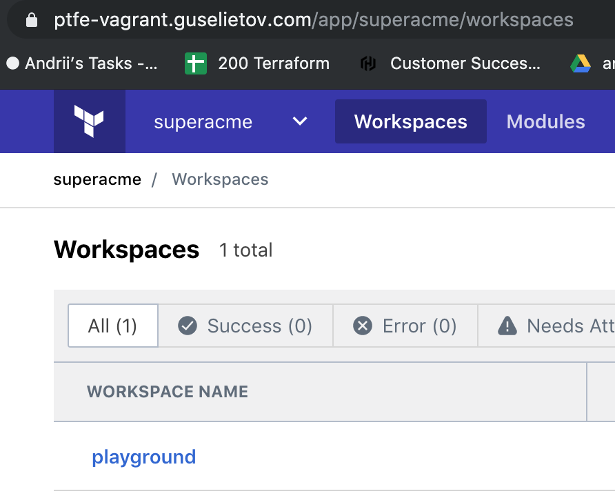
    
    > Names do not matter, but we are going to see that everything is restored from backup by checking that proper organization and workspace is in place, later.

When you *are logged in* a new PTFE installation with organization and workspace -  installation is done. Now let's work with snapshots.

## Working with snapshots


### Creating Snapshot
- Go to the *Admin Console* of PTFE: https://ptfe-vagrant.guselietov.com:8800/dashboard, at the right side of it you are going to see the section with the text *"Snapshots Enabled"* and a button **[Start Snapshot]**, press it  :

    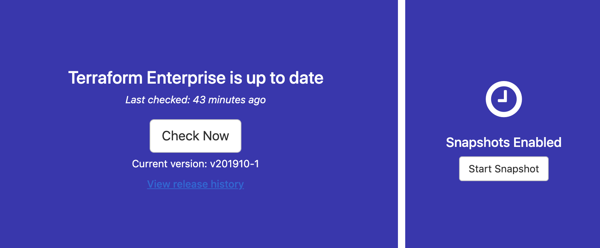

- After you have pressed the button, the right section is going to display progress through the series of status messages : 

    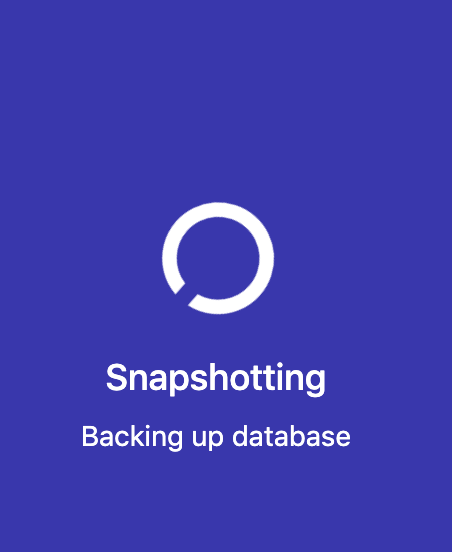

    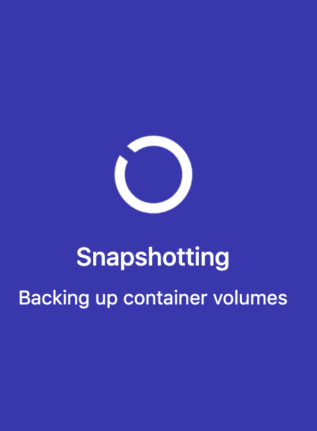

- When the snapshot is done, the section is going to change, to indicate the date and time of the last snapshot, and bearing 2 buttons - **[Start Snapshot]** and **[History]** : 

    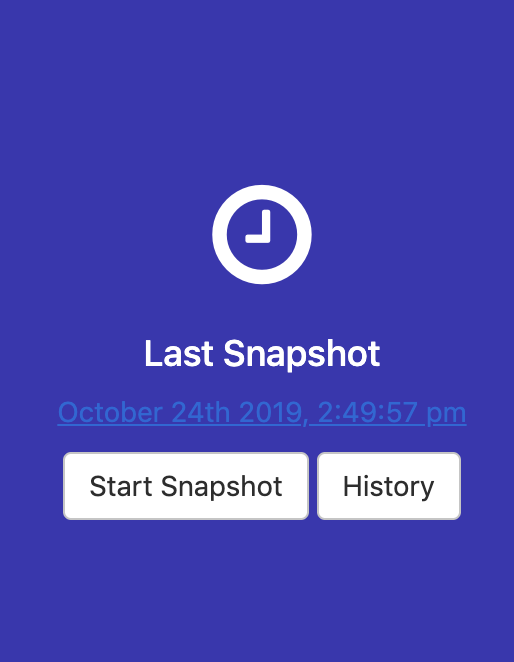

### Imitating full application disaster

In order to demonstrate recovery from a snapshot we are going to simulate full application disaster - wipe it out completely (preserving snapshot) and then restoring with the state.

- Login via SSH to your VM (or reuser existing SSH session), by executing : 
    ```
    vagrant ssh
    ```
- Become root :
    ```
    sudo su -
    ```
- There is a special script that will imitate the crash and disaster, but still preseve our snapshots in [/home/vagrant/delete_all.sh](delete_all.sh), 
execute it (**still under root privileges**):
    ```bash
    bash /home/vagrant/delete_all.sh
    ```
    The output should be similar to the one below :
    ```bash
    /var/lib/replicated/snapshots is not a mountpoint
    sending incremental file list
    created directory /root/snap
    ./
    files/
    files/db.dump
            41,827 100%    8.64MB/s    0:00:00 (xfr#1, to-chk=21/26)
    sha256/
    sha256/18867d9f7a7ac192f4ce71a93a5c80190bbd7f677ba8d201abb2f83d3c58068b
            1,412 100%    1.35MB/s    0:00:00 (xfr#2, to-chk=20/26)
    ...
    sha256/fe1278b0a1c542741f1f8680d4789527499b901c66a31d1c8fc9eedc9b7279e1
                884 100%   13.49kB/s    0:00:00 (xfr#22, to-chk=0/26)
    tmp/

    sent 99,792,814 bytes  received 490 bytes  28,512,372.57 bytes/sec
    total size is 99,775,602  speedup is 1.00
    CONTAINER ID        IMAGE               COMMAND             CREATED             STATUS              PORTS               NAMES
    sending incremental file list
    ./
    files/
    files/db.dump
            41,827 100%    8.64MB/s    0:00:00 (xfr#1, to-chk=21/26)
    sha256/
    sha256/18867d9f7a7ac192f4ce71a93a5c80190bbd7f677ba8d201abb2f83d3c58068b
            1,412 100%    1.35MB/s    0:00:00 (xfr#2, to-chk=20/26)
    ...
    sha256/fe1278b0a1c542741f1f8680d4789527499b901c66a31d1c8fc9eedc9b7279e1
                884 100%    1.45kB/s    0:00:00 (xfr#22, to-chk=0/26)
    tmp/

    sent 99,792,818 bytes  received 457 bytes  28,512,364.29 bytes/sec
    total size is 99,775,602  speedup is 1.00    
    ``` 
- Let's check that we indeed "have killed" our application by accessing the Admin Dashboard at the URL : https://ptfe-vagrant.guselietov.com:8800/dashboard, and we see : 

    


### Restore from a snapshot

- If you are still in SSH session with your VM  ,reuse it, otherwise please connect once more by executing : 
    ```
    vagrant ssh
    ```
- Become root :
    ```
    sudo su -
    ```
- The earlier run of our script [/home/vagrant/delete_all.sh](delete_all.sh) actually preserved the content of `/var/lib/replicated/snapshots/`
and also have synced it to `/root/snap`. Let's check that both locations contain something and are not empty.
    - Execute : 
    ```bash
    du -h /var/lib/replicated/snapshots/

    96M    /var/lib/replicated/snapshots/sha256
    48K    /var/lib/replicated/snapshots/files
    4.0K    /var/lib/replicated/snapshots/tmp
    96M    /var/lib/replicated/snapshots/
    ```
    okay we have 96M of saved data
    and the same for `/root/snap` :
    ```bash
    du -h /root/snap/                   
    96M    /root/snap/sha256
    48K    /root/snap/files
    4.0K    /root/snap/tmp
    96M    /root/snap/    
    ```
- Log-out from root account by executing : 
    ```
    exit
    ``` 
    ( or pressing [Ctrl]+[D] simultaneously )
- Start installation of PTFE again (remember? wqe wiped out everything) by executing : 
    ```bash
    curl https://install.terraform.io/ptfe/stable | sudo bash
    ```
- Repeat everything for the terminal portion of the install
    - select and use IP-address `192.168.56.22` for the service), no proxy
- Go the Web-portion of PTFE install, open in your browser : http://192.168.56.22:8800 
    - Press **[Continue to Setup]** and confirm security exception
    - at the screen *"HTTPS for admin console"* - supply proper SSL keys (**SAME as first time!**), certificate and bundle, use the name *"ptfe-vagrant.guselietov.com"* for the host (again - SAME name)
    - Press **[Upload & Continue]**
- Now, at the screen asking for the license, should be the link below : **[Restore from a snapshot]** : 
    
    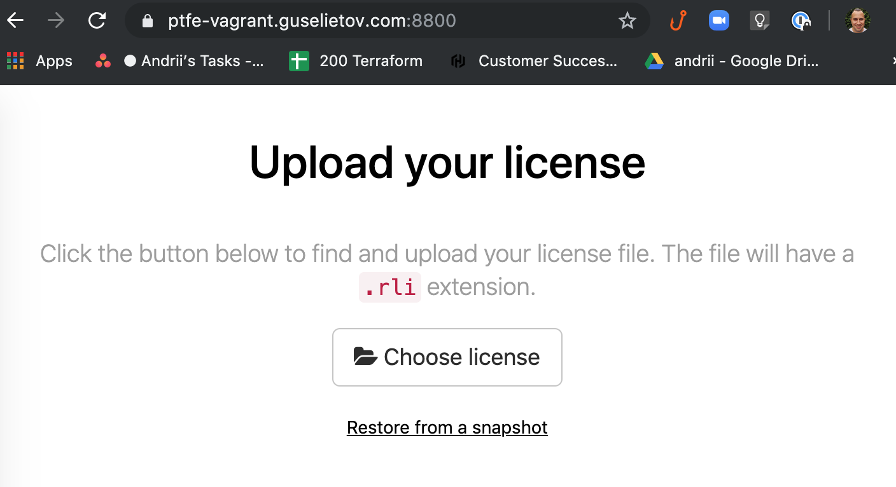

    Click it

- At the next screen you going to see: *Restore from a snapshot* with the message below -  *No snapshot found*

    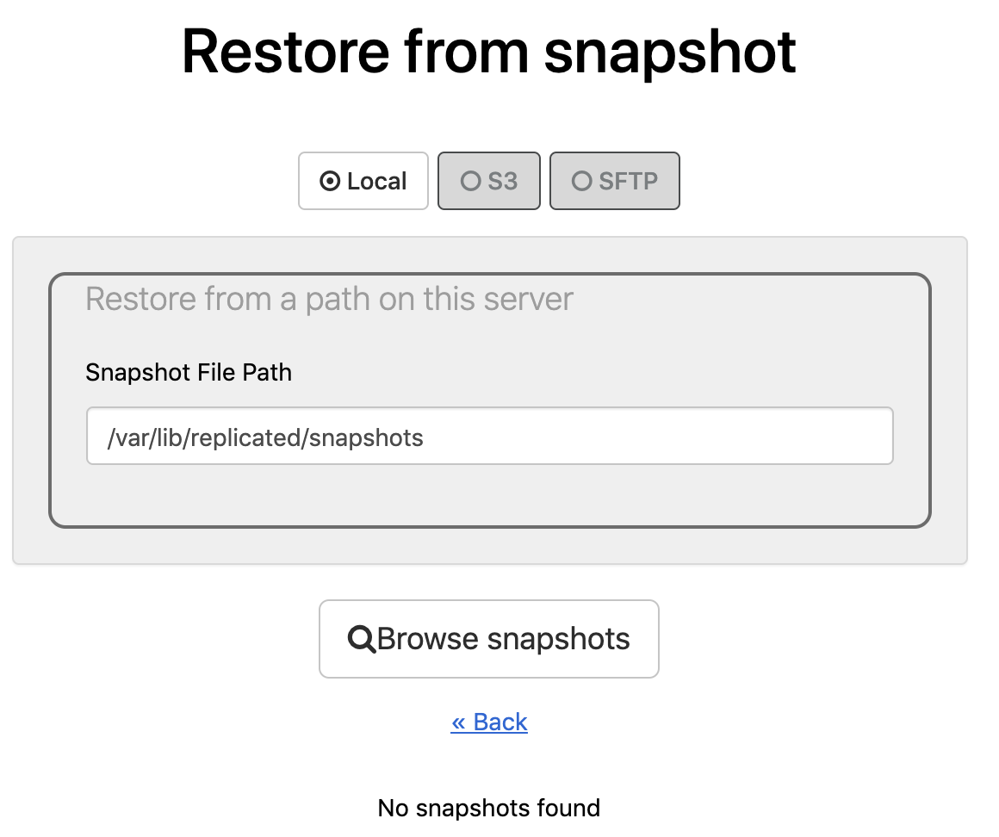

    Press the button **[Browse snapshots]**, and you going to see after some time : 

    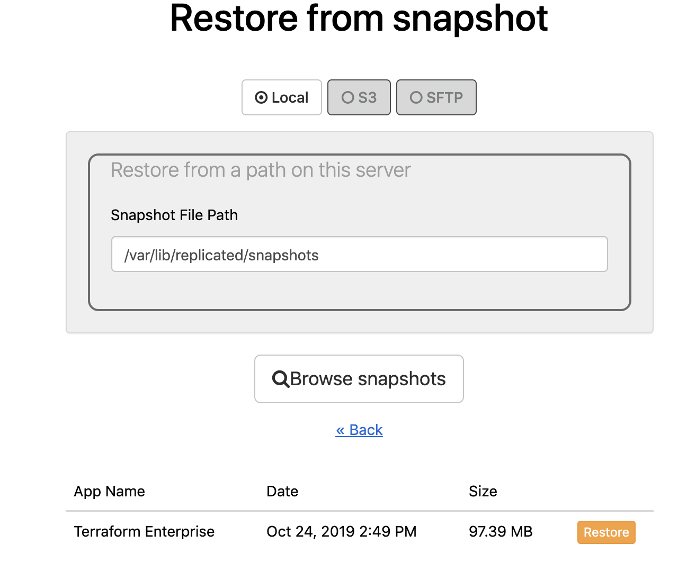

- Choose the latest snapshot in the list and press the small button **[restore]** next to it, after that you will see a series of the screens with progress status  :

    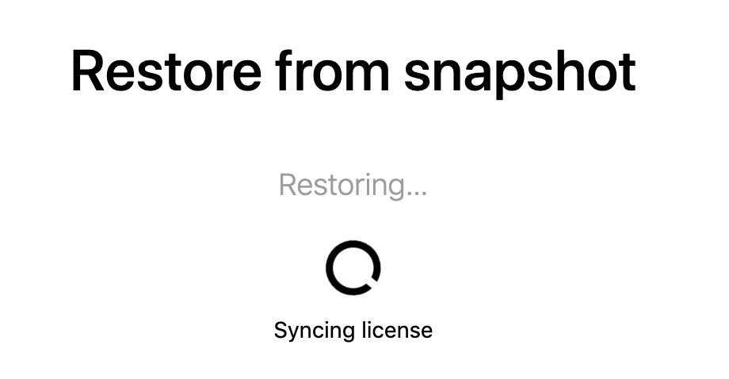

    And at the end - request to **unlock Admin Console**: 

    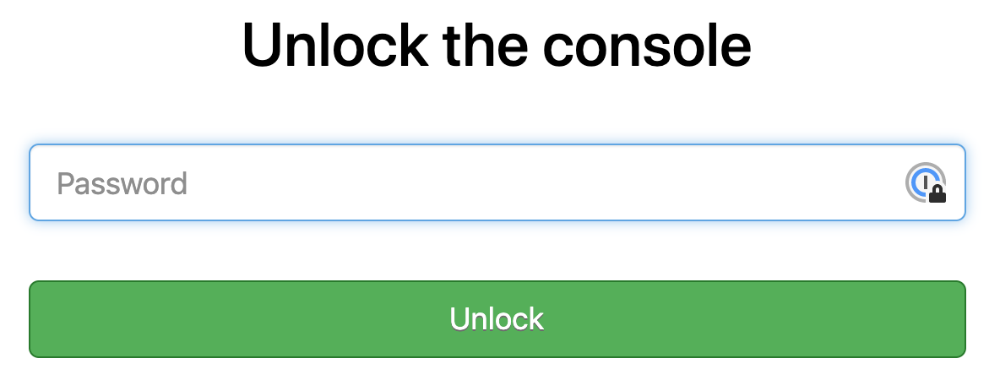

- Unlock the console by entering the password from the very first installation and you will see again screen with *"Preflight Checks"*, press **[Continue]** button

-  Now you will see next screen - *Restore Cluster*, press the button **Restore** :

    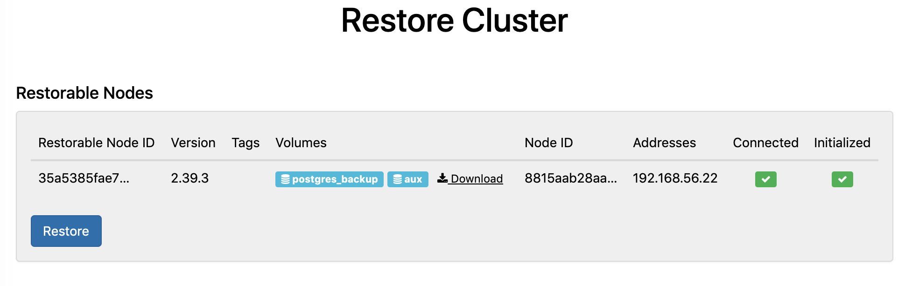

- After the process is finished, you going to see **"Cluster"** state page from where you can directly go to the *(Dashboard of Admin Console* and observe the progress in the left section : 

    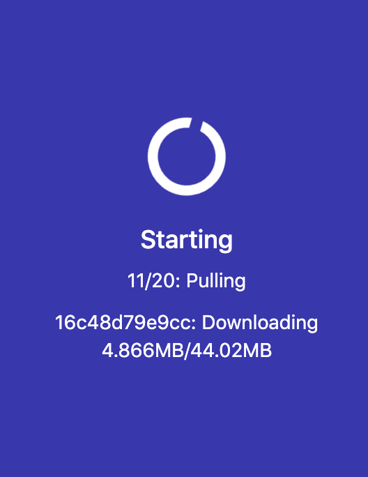

    and if you look at the greater picture : 

    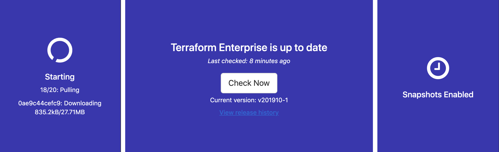

    > Note: You can spot that the right section right now have only **Snapshots Enabled** message, and nothing more.

    Wait until it finishes.

- Open *PTFE Dashboard* ( not Admin Console!), at workspaces for our [Looney Tunes-inspired organization](https://en.wikipedia.org/wiki/Acme_Corporation) : https://ptfe-vagrant.guselietov.com/app/superacme/workspaces :

    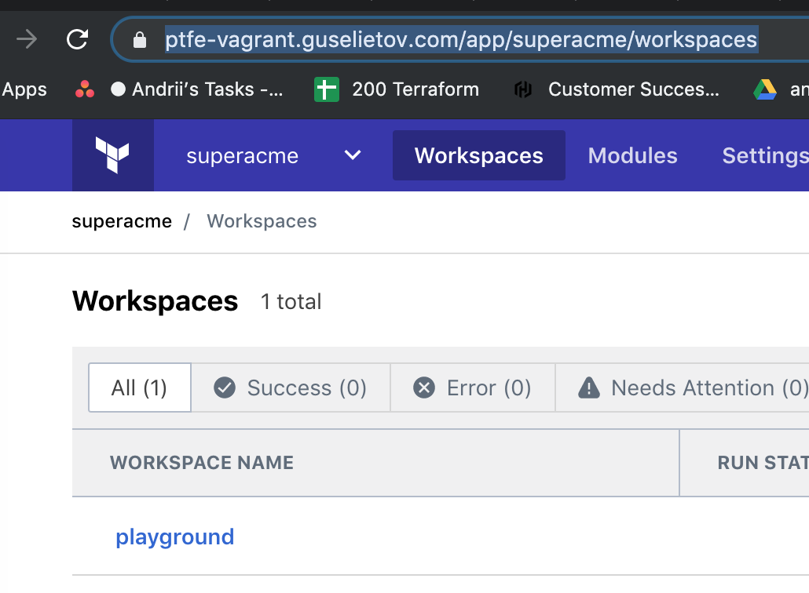

    As you can see from the screenshot - everything is in place.

This concludes the instruction section. now we have successfully performed the restore from a snapshot and resurrected our PTFE. Thank you.


# Technologies

1. **To download the content of this repository** you will need **git command-line tools**(recommended) or **Git UI Client**. To install official command-line Git tools please [find here instructions](https://git-scm.com/book/en/v2/Getting-Started-Installing-Git) for various operating systems. 
2. **For managing infrastructure** we using Terraform - open-source infrastructure as a code software tool created by HashiCorp. It enables users to define and provision a data center infrastructure using a high-level configuration language known as Hashicorp Configuration Language, or optionally JSON. More you encouraged to [learn here](https://www.terraform.io). 
3. **This project for virtualization** uses **AWS EC2** - Amazon Elastic Compute Cloud (Amazon EC2 for short) - a web service that provides secure, resizable compute capacity in the cloud. It is designed to make web-scale cloud computing easier for developers. You can read in details and create a free try-out account if you don't have one here :  [Amazon EC2 main page](https://aws.amazon.com/ec2/) 
4. **Nginx stands apart - as it will be downloaded and installed automatically during the provision.** Nginx is an open-source HTTP Web server and reverse proxy server. In addition to offering HTTP server capabilities, Nginx can also operate as an IMAP/POP3 mail proxy server as well as function as a load balancer and HTTP cache server. You can get more information about it  - check [official website here](https://www.nginx.com)  
5. **GoDaddy** - GoDaddy Inc. is an American publicly traded Internet domain registrar and web hosting company, headquartered in Scottsdale, Arizona, and incorporated in Delaware. More information here: https://www.godaddy.com/
6. **Let'sEncrypt** - Let's Encrypt is a non-profit certificate authority run by Internet Security Research Group that provides X.509 certificates for Transport Layer Security encryption at no charge. The certificate is valid for 90 days, during which renewal can take place at any time. You can find out more on their [official page](https://letsencrypt.org/)


# TODO


# DONE
- [x] - create Vagrant machine
- [x] - re-use certificate and DNS settings from repo : https://github.com/Galser/ptfe-demo-validcert
- [x] - install PTFE
- [x] - configure snapshots
- [x] - make backup
- [x] - make restore
- [x] - use snapshot
- [x] - update README
